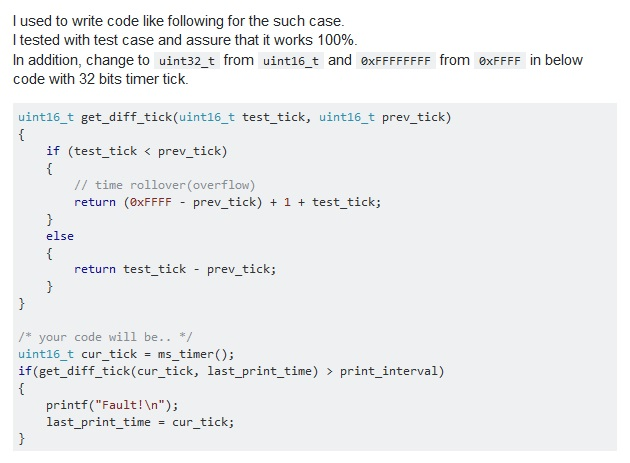

========================
문법
========================

.. contents:: a title for the contents
    :depth: 2

------------------------
문서 업데이트
------------------------
명령창 실행 후 문서가 있는 폴더에서 빌드 후 커밋

		workspace_github\bldc\docs> ./make clean; ./make html

------------------------
글쓰기
------------------------

# raw-form
이것은 문단 입니다. 매우 짧은
첫번째 문단 입니다.

    이것은 두번째 문단입니다. 한단계 들여쓰기 되어 있습니다.
    문단은 빈 줄로 구분됩니다.

이것은 마지막 문단입니다.

# results in
이것은 문단 입니다. 매우 짧은 첫번째 문단 입니다.

  이것은 두번째 문단입니다. 한단계 들여쓰기 되어 있습니다. 문단은 빈 줄로 구분됩니다.
    
이것은 마지막 문단입니다.

항목1
  항목1의 정의 입니다. 이것은 두번째 문단입니다. 한단계 들여쓰기 되어 있습니다. 문단은 빈 줄로 구분됩니다. (빈줄을 추가하면 줄바꿈이 되는 것 같습니다.)
  
  이것은 두번째 문단입니다. 한단계 들여쓰기 되어 있습니다. 문단은 빈 줄로 구분됩니다.
  항목1의 정의

항목2
  항목2의 정의 입니다.
  항목2의 정의

Definition lists:

what
  Definition lists associate a term with
  a definition.

how
  The term is a one-line phrase, and the
  definition is one or more paragraphs or
  body elements, indented relative to the
  term. Blank lines are not allowed
  between term and definition.	

:Authors:
    Tony J. (Tibs) Ibbs,
    David Goodger
    (and sundry other good-natured folks)
:Version: 1.0 of 2001/08/08
:Dedication: To my father.

A paragraph containing only two colons
indicates that the following indented
or quoted text is a literal block.

::

  Whitespace, newlines, blank lines, and all kinds of markup (like *this* or 
  \this) is preserved by literal blocks.

  The paragraph containing only '::' will be omitted from the result.

The ``::`` may be tacked onto the very
end of any paragraph. The ``::`` will be
omitted if it is preceded by whitespace.
The ``::`` will be converted to a single
colon if preceded by text, like this

::

  It's very convenient to use this form.

Literal blocks end when text returns to
the preceding paragraph's indentation.
This means that something like this
is possible

::

      We start here
    and continue here
  and end here.

웹페이지 확대/축소 고정

* 크롬 설정 -> 모양 -> 페이지 확대/축소 설정
* 마이크로소프트 에지 설정 -> 브라우저 디스플레이 -> 페이지 확대/축소 설정

--------

-a            옵션 a 설명
-b file       옵션 b 설명
--opt_a       옵션 opt_a 설명
-a            command-line option "a"
-b file       options can have arguments
              and long descriptions
--long        options can be long also
--input=file  long options can also have
              arguments
/V            DOS/VMS-style options too

------------------------
테이블 종류
------------------------

.. list-table::
   :header-rows: 1

   * - A
     - B
     - C
   * - data1
     - data2
     - data3

--------

.. csv-table:: 테이블타이틀(없어도됨)
   :header-rows: 1

   A, B, C
   data1, data2, data3

------------------------
링크
------------------------

사용법의 경우 사용법을 전부 직접 작성하기에는 시간이 많이 걸리므로 웹페이지를 mhtml을 저장해서 링크걸기

* `sphinx-collapse <https://pypi.org/project/sphinx_collapse/>`_
* `sphinx-toolbox <https://sphinx-toolbox.readthedocs.io/en/stable/index.html>`_
* 파이썬_
* `파이썬 <http://www.python.org/>`_

.. _파이썬: http://www.python.org/

.. note::  This is a **note** box.

.. warning:: note the space between the directive and the text

.. topic:: Your Topic Title

  Subsequent indented lines comprise
  the body of the topic, and are
  interpreted as body elements.

제목 링크 : `테이블 종류`_

.. comments
  주석처리
  Comments can be made by adding two dots at the beginning of a line as follows:

